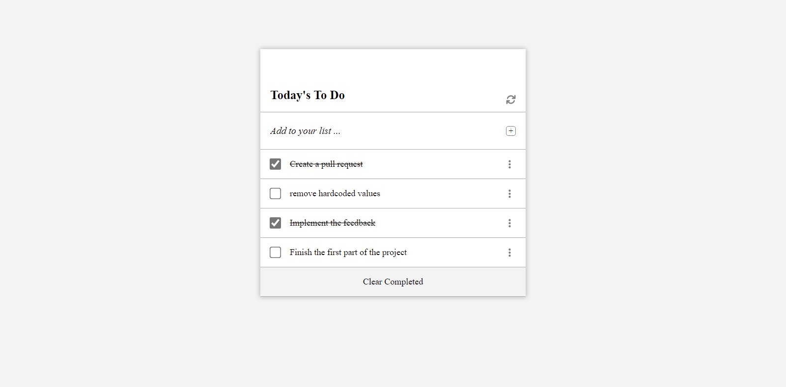

# TODO WEB APPLICATION

> Todo is a web application that allows people to manage their tasks more conveniently while working on any project. The board lists all of the tasks that need to be accomplished, and it also allows you to delete completed tasks from the board.

## Create a todo list



Additional description about the project and its features.

## Tech used

- HTML
- CSS
- JS
- Git
- Webpack

## Live Demo

[Live Demo Link](https://mwafrika.github.io/peer-review-todo-list/)

## Built With

- Lighthouse (An open-source, automated tool for improving the quality of web pages. It has audits for performance, accessibility, progressive web apps, SEO and more).
- Webhint (A customizable linting tool that helps you improve your site's accessibility, speed, cross-browser compatibility, and more by checking your code for best practices and common errors).
- Stylelint (A mighty, modern linter that helps you avoid errors and enforce conventions in your styles).

To get a local copy up and running follow these simple example steps

### Prerequisites

The basic requirements for building the executable are:

- A working browser application (Google chrome, Mozilla Fire fox, Microsoft edge ...)
- VSCode or any other equivalent code editor
- Node Package Manager (For running, debuging, or installing dependancies to be used)

<br>
<br>

# Setup WebApp

### Get the full documentation about the webpack [here](https://webpack.js.org/guides/asset-management/)

#### Cloning the project

```
git clone https://github.com/vikipretium/awesome-books-project.git
```

## Getting packages and debuging with Stylelint

```
npm install --save-dev stylelint@13.x stylelint-scss@3.x stylelint-config-standard@21.x stylelint-csstree-validator@1.x
```

##### For validation detection using Stylelint Run

```
npx stylelint "**/*.{css,scss}"
```

##### from parent source directory

## Getting packages and debuging with Webhint

```
npm init -y
npm install --save-dev hint@6.x
```

##### For validation detection using Webhint Run

```
npx hint .
```

## Getting packages and debuging with Eslint

```
npm install --save-dev eslint@7.x eslint-config-airbnb-base@14.x eslint-plugin-import@2.x babel-eslint@10.x

```

##### For validation detection using Eslint Run

```

npx eslint .

```

👤 **Mwafrika Josue**

- GitHub: [@mwafrika](https://github.com/mwafrika)
- Twitter: [@mwafrika](https://twitter.com/mwafrikamufung1)
- LinkedIn: [mwafrika](https://linkedin.com/in/mwafrika-mufungizi)

Contributions, issues, and feature requests are welcome!

Feel free to check the [issues page](../../issues/).

## Show your support

Give a ⭐️ if you like this project!

## Acknowledgments

- Hat tip to anyone whose code was used
- Inspiration
- etc

## 📝 License

This project is [MIT](./MIT.md) licensed.
